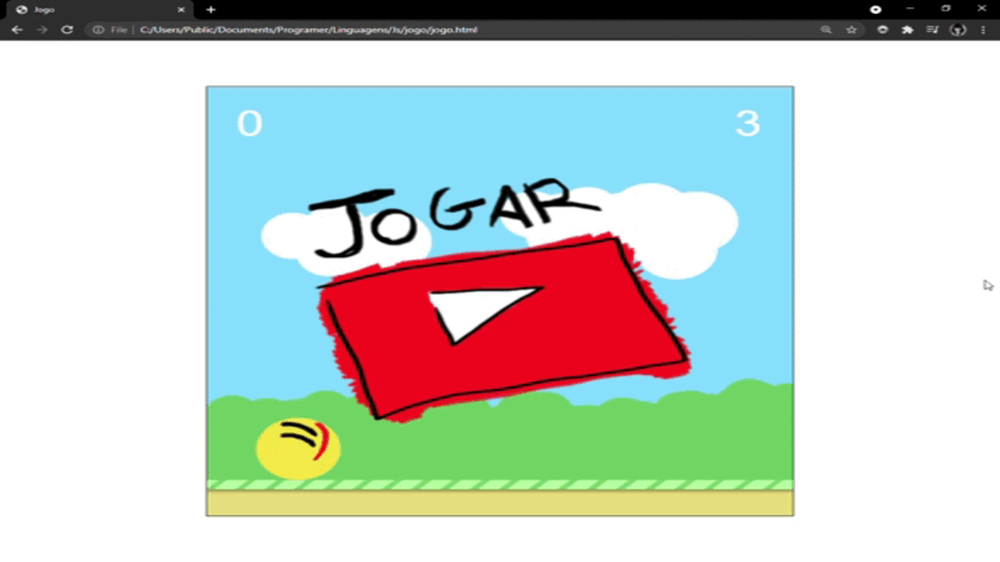

<h1 align="center"> Yellow Ball </h1>

Game Recreation and Adaptation

  
## 🎯 Functionalities
✔️ The coded program seeks to recreate the famous game "Yellow Ball";  
✔️ The program recognizes the use of mouse click to jump;  
✔️ The program contains scenarios and visual objects;  
✔️ The program has phases, lives and obstacles;  
✔️ The program recognizes a new record and updates it on the screen;  
✔️ The program allows the user to play as many times as he wants;  
✔️ The tutorial "Veslasoft" was used as an example.

## 🚀 Languages
✔️ JavaScript, HTML5 e CSS.

## 🎨 Layout and Execution

       
      
## ⚖️ License
✔️ MIT License.

## 🔥 About Myself
  

  

  
   
  

